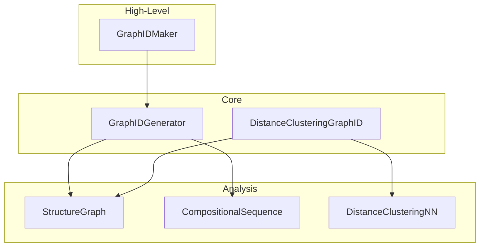

# API Reference

This section provides detailed documentation for all public classes and functions in Graph ID.

## Overview

Graph ID provides several levels of API:



## Module Structure

### graph_id

The main package providing high-level interfaces:

```python
from graph_id import GraphIDMaker, GraphIDGenerator
```

| Class | Description |
|-------|-------------|
| [`GraphIDMaker`](maker.md) | Simple interface with sensible defaults |
| [`GraphIDGenerator`](generator.md) | Full-featured Python generator |

### graph_id.core

Core implementation modules:

```python
from graph_id.core.graph_id import GraphIDGenerator
from graph_id.core.distance_clustering_graph_id import DistanceClusteringGraphID
```

| Class | Description |
|-------|-------------|
| [`GraphIDGenerator`](generator.md) | Python implementation of Graph ID generation |
| [`DistanceClusteringGraphID`](distance-clustering.md) | Distance-based clustering variant |

### graph_id.analysis

Analysis utilities:

```python
from graph_id.analysis.graphs import StructureGraph
from graph_id.analysis.compositional_sequence import CompositionalSequence
from graph_id.analysis.local_env import DistanceClusteringNN
```

| Class | Description |
|-------|-------------|
| [`StructureGraph`](analysis.md#structuregraph) | Extended pymatgen StructureGraph |
| [`CompositionalSequence`](analysis.md#compositionalsequence) | Compositional sequence computation |
| [`DistanceClusteringNN`](analysis.md#distanceclusteringnn) | DBSCAN-based neighbor detection |

### graph_id_cpp

C++ extension module (compiled):

```python
from graph_id_cpp import (
    GraphIDGenerator,
    MinimumDistanceNN,
    CrystalNN,
)
```

| Class | Description |
|-------|-------------|
| `GraphIDGenerator` | C++ implementation (fastest) |
| `MinimumDistanceNN` | C++ neighbor detection |
| `CrystalNN` | C++ Voronoi-based neighbors |

## Quick Reference

### Common Operations

| Task | Code |
|------|------|
| Generate ID | `GraphIDMaker().get_id(structure)` |
| Compare structures | `gen.are_same(struct1, struct2)` |
| Get unique structures | `gen.get_unique_structures(structures)` |
| Get site info | `maker.get_site_ids(structure)` |
| Batch processing | `gen.get_many_ids(structures, parallel=True)` |

### Configuration Options

| Option | Default | Description |
|--------|---------|-------------|
| `nn` | `MinimumDistanceNN()` | Neighbor detection |
| `wyckoff` | `False` | Include Wyckoff positions |
| `topology_only` | `False` | Ignore element types |
| `loop` | `False` | Use loop-based identification |
| `diameter_factor` | `2` | Depth multiplier |
| `additional_depth` | `1` | Extra traversal depth |
| `digest_size` | `8` | Hash output length |

## Type Hints

Graph ID uses type hints throughout. Key types:

```python
from typing import TYPE_CHECKING

if TYPE_CHECKING:
    from pymatgen.core.structure import Structure
    from pymatgen.analysis.local_env import NearNeighbors
```

## Detailed Documentation

- [GraphIDMaker](maker.md) - High-level interface
- [GraphIDGenerator](generator.md) - Core Python generator
- [DistanceClusteringGraphID](distance-clustering.md) - Clustering-based variant
- [Analysis Module](analysis.md) - Low-level utilities
