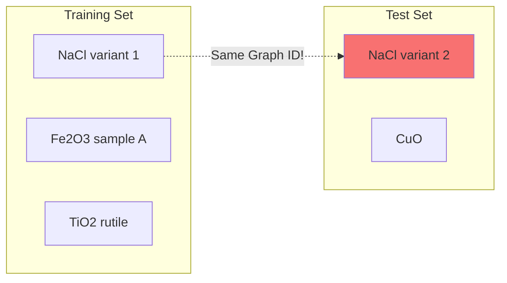

# Machine Learning with Graph ID

Graph ID plays a crucial role in ensuring proper evaluation of machine learning models for materials property prediction.

## The Data Leakage Problem

In materials informatics, data leakage occurs when the training and test sets contain structurally identical materials. This leads to **overly optimistic** performance estimates because the model has effectively "seen" the test structures during training.



Graph ID solves this by providing a reliable way to detect and remove duplicate structures.

## Detecting Data Leakage

```python
import graph_id_cpp
from pymatgen.core import Structure

def check_leakage(train_structures, test_structures):
    """Identify test structures that are duplicates of training structures."""
    gen = graph_id_cpp.GraphIDGenerator()

    # Get training Graph IDs
    train_ids = set()
    for struct in train_structures:
        train_ids.add(gen.get_id(struct))

    # Check test set for leakage
    leaked = []
    novel = []

    for i, struct in enumerate(test_structures):
        test_id = gen.get_id(struct)
        if test_id in train_ids:
            leaked.append(i)
        else:
            novel.append(i)

    print(f"Leaked: {len(leaked)}, Novel: {len(novel)}")
    return leaked, novel
```

## Real-World Example: Materials Project

The `examples/machine_learning/` directory contains a complete example demonstrating the impact of data leakage on model evaluation.

### Setup

1. Download the Materials Project dataset from [Figshare](https://figshare.com/articles/dataset/Graphs_of_Materials_Project_20190401/8097992)
2. Place `mp.2019.04.01.json` in your working directory
3. Run the training script

### Key Results

The example compares MAE (Mean Absolute Error) for formation energy prediction:

| Test Split | Description | Expected MAE |
|------------|-------------|--------------|
| **Leaked** | Structures with Graph IDs in training set | Lower (optimistic) |
| **Unleaked** | Novel structures not in training | Higher (realistic) |

!!! warning "Typical Finding"
    Models often show **significantly lower error** on leaked test data, giving a false impression of generalization capability.

### Code Overview

```python
import graph_id_cpp
import pandas as pd
from sklearn.model_selection import train_test_split

# Load data
data_df = load_materials_data()

# Split data
train_df, test_df = train_test_split(data_df, train_size=0.5)

# Train model
model.fit(X_train, y_train)

# Separate leaked vs unleaked test samples
leaked_df = test_df[test_df.graph_id.isin(train_df.graph_id)]
novel_df = test_df[~test_df.graph_id.isin(train_df.graph_id)]

# Evaluate separately
leaked_mae = evaluate(model, leaked_df)   # Optimistic!
novel_mae = evaluate(model, novel_df)     # Realistic
```

## Using Graph ID for Proper Train/Test Splits

### Strategy 1: Remove Duplicates First

```python
from graph_id.core.graph_id import GraphIDGenerator

gen = GraphIDGenerator()

# Deduplicate entire dataset
unique_structures = gen.get_unique_structures(all_structures)

# Then split
train, test = train_test_split(unique_structures, test_size=0.2)
```

### Strategy 2: Split by Graph ID

```python
import graph_id_cpp
from sklearn.model_selection import GroupShuffleSplit

gen = graph_id_cpp.GraphIDGenerator()

# Assign Graph IDs as groups
graph_ids = [gen.get_id(s) for s in structures]

# Split ensuring no Graph ID appears in both train and test
splitter = GroupShuffleSplit(n_splits=1, test_size=0.2)
train_idx, test_idx = next(splitter.split(structures, groups=graph_ids))
```

## Using Site IDs as Features

Site-level compositional sequences can serve as structural descriptors:

```python
from graph_id import GraphIDMaker
from collections import Counter
import numpy as np

def structure_fingerprint(structure, maker=None):
    """Create a fingerprint based on compositional sequences."""
    if maker is None:
        maker = GraphIDMaker()

    site_ids = maker.get_site_ids(structure)

    # Count unique site environments
    env_counts = Counter(site_ids.values())

    # Create a sorted fingerprint
    fingerprint = []
    for env, count in sorted(env_counts.items()):
        fingerprint.append((hash(env) % 10000, count))

    return fingerprint
```

## Clustering Structures

Use Graph ID for structure-aware clustering:

```python
from graph_id import GraphIDMaker
from collections import defaultdict

def group_by_structure(structures):
    """Group structures by their Graph ID."""
    maker = GraphIDMaker()

    groups = defaultdict(list)
    for i, struct in enumerate(structures):
        gid = maker.get_id(struct)
        groups[gid].append(i)

    return dict(groups)

# Example usage
groups = group_by_structure(my_structures)
print(f"Found {len(groups)} unique structure types")

for gid, indices in list(groups.items())[:5]:
    print(f"  {gid}: {len(indices)} structures")
```

## Best Practices

!!! tip "Recommendations for ML Workflows"

    1. **Always check for leakage** before reporting results

    2. **Report both leaked and unleaked metrics** for transparency

    3. **Use Graph ID for cross-validation** to ensure folds are truly independent

    4. **Deduplicate training data** to avoid wasted computation

    5. **Consider topology-only IDs** for structure-type stratification

## Complete Example

The full training script is available at:

```
examples/machine_learning/train.py
```

This includes:

- Data loading from Materials Project JSON
- Matminer featurization
- Graph ID computation and caching
- Train/test splitting
- Model training with Random Forest
- Separate evaluation of leaked vs unleaked test data

### Running the Example

```bash
cd examples/machine_learning
python train.py
```

Expected output:

```
MAE of whole test data: 0.XXX
MAE of leaked test data: 0.XXX  (lower)
MAE of unleaked test data: 0.XXX  (higher)
```
