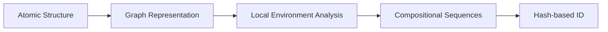

# Graph ID

<div style="text-align: center; margin: 2rem 0;">
  <p style="font-size: 1.3rem; color: var(--md-default-fg-color--light);">
    A universal identifier system for atomistic structures
  </p>
</div>

[](https://pypi.org/project/graph-id-core/)
[](https://pypi.org/project/graph-id-core/)
[](https://codecov.io/gh/kmu/graph-id-core)

---

## What is Graph ID?

**Graph ID** generates unique, deterministic identifiers for atomistic structures including crystals and molecules. It works by converting atomic structures into graph representations and computing hash-based identifiers that capture both topology and composition.

<!--
<div class="grid cards" markdown>

- :material-fingerprint:{ .lg .middle } **Unique Identification**

    ---

    Generate deterministic IDs for any crystal or molecular structure

- :material-graph:{ .lg .middle } **Topological Analysis**

    ---

    Option to generate topology-only IDs for structure type comparison

- :fontawesome-solid-bolt:{ .lg .middle } **High Performance**

    ---

    C++ backend with Python bindings for blazing-fast computation

- :material-database:{ .lg .middle } **Database Ready**

    ---

    Efficient indexing and deduplication of structure databases

</div>
-->

## Quick Example

```python
from pymatgen.core import Structure, Lattice
from graph_id import GraphIDMaker

# Create a structure (NaCl)
structure = Structure.from_spacegroup(
    "Fm-3m",
    Lattice.cubic(5.692),
    ["Na", "Cl"],
    [[0, 0, 0], [0.5, 0.5, 0.5]]
)

# Generate Graph ID
maker = GraphIDMaker()
graph_id = maker.get_id(structure)
print(graph_id)  # Output: NaCl-88c8e156db1b0fd9
```

## How It Works

Graph ID operates through a multi-step process:



1. **Graph Construction**: Convert atomic structures into graph representations where atoms are nodes and bonds are edges
2. **Environment Analysis**: Analyze the local chemical environment around each atom using compositional sequences
3. **Hash Generation**: Compute a deterministic hash-based identifier that captures both topology and composition

## Applications

Graph ID is particularly useful for:

- **Materials Databases**: Efficient indexing and deduplication of structure databases
- **High-throughput Screening**: Rapid identification of unique structures in computational workflows
- **Polymorph Identification**: Distinguishing between different polymorphs of the same composition
- **Machine Learning**: Feature engineering for materials property prediction

## Web Service

!!! tip "Try it online"
    You can search materials using Graph ID at [matfinder.net](https://matfinder.net)

## Next Steps

<div class="grid cards" markdown>

- [:material-download: **Installation**](getting-started/installation.md)

    Get Graph ID installed on your system

- [:material-rocket-launch: **Quick Start**](getting-started/quickstart.md)

    Learn the basics with hands-on examples

- [:material-book-open-variant: **API Reference**](api/index.md)

    Explore the complete API documentation

</div>
